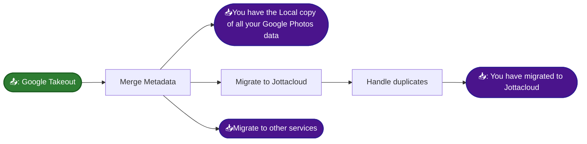

# Migrate from Google Photo

Google Photos seems to be a great tool for uploading images and sharing them with others. Unfortunately, beneath this attractive surface lies a lock-in effect that becomes apparent when you try to export all your photos to your local hard drive or another photo service.

Google provides the Takeout tool to export all photos so they can be stored locally. However, the format of the export is far from what would be considered usable, as each image is split into two separate files: one image file and one metadata file.

This project provides a guide on how to overcome this lock-in effect.



[Instructions how to migrate to JottaCloud](/migrate-to-jottacloud/README.md).

# Migrate or locally store your photos from Google Photos

## Prerequisites

Visit [Google Photos Migrate](https://github.com/garzj/google-photos-migrate) and read their prerequisites.

## Merge metadata files

Start by using the Takeout self-service tool:

[Google Takeout](https://takeout.google.com/)

The Takeout tool makes it possible to create a local backup of all your photos or migrate to another photo service.


The self-service is accessible and easy to use for downloading all your photos, but there are a few extra steps needed after you download all your content from Google Photos.


You can go through the following steps to take out your photos and videos:

1. Use the self-service to request a takeout of all the content within Google Photos.
2. Google will prepare several zip files for you to download, containing all your content within the Google Photos service. Download all takeout files to the [takeout](./takeout/) inside this project's directory. **Note:** It is important that *all* zip files from the export are placed in the folder ./takeout before proceeding, as Google randomly distributes photos and their associated metadata (JSON files) across different zip files.
3. Use the shell script `process_google_takeout.sh`, and provide the path to the `takeout` folder as an argument.

```sh
sh process_google_takeout.sh ./takeout/
```

The shell script unzips all the takeout files into one single folder and then uses the Node.js-based open-source tool [Google Photo Migrate](https://github.com/garzj/google-photos-migrate) to add metadata to images and videos.

### Note on Errors and Unsupported Files

During the migration of metadata, some files might be placed in the `error` folder created by the script. This typically happens for:

- **Live Photos / Motion Photos (`.MP`, `.MP4`):** When capturing a Live Photo, modern smartphones generate both a still image and a short video clip. Google Takeout usually only provides a metadata JSON file for the still image (`.jpg`), leaving the accompanying video file without one.
- **Edited or Duplicated Images (`-edited.jpg`, `(1).jpg`, `~2.jpg`):** If an image has been cropped or filtered within Google Photos, Google exports both the original and the edited version. Often, only the original image receives a JSON file, causing the edited versions to fail the metadata match.

Files that end up in the `error` folder will **not** be assigned corrected metadata and will **not** be included in the final upload to Jottacloud by the migration script. The original still images for these files are typically successfully processed and placed in the `output` folder.


## Disclaimer

These scripts and instructions are provided "as is" without warranty of any kind. Users are strongly advised to verify backups before deleting any data. The author assumes no liability for data loss or damages resulting from the use of these tools. Use at your own risk.
